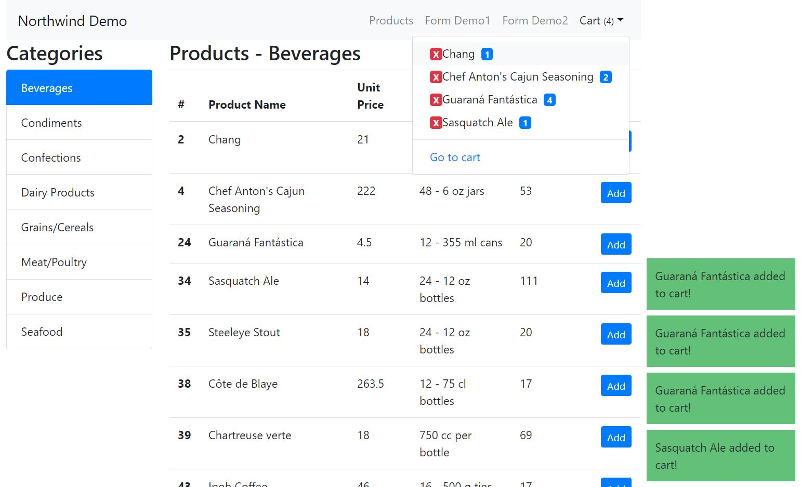

# React Northwind Demo

I created this repo for understanding the React syntax.

## Getting Started

These instructions will get you a copy of the project up and running on your local machine.

### Prerequisites

This project uses Local API therefore it needs to install "json-server". (It uses localhost:3000 as default port)

```
npm install json-server
```

### Installing

You can clone the repository in cmd.

```
git clone https://github.com/sefadogan/react-northwind-demo
```

Then you have to download all dependencies.

```
npm install
```

Go to file directory which name is "api". 

```
json-server --watch db.json
```

Then we can start the project. (NPM will ask you "Would you like to run the app an another port instead?"). Because of json-server is using the default port.

```
npm start
```

### Screenshoots



